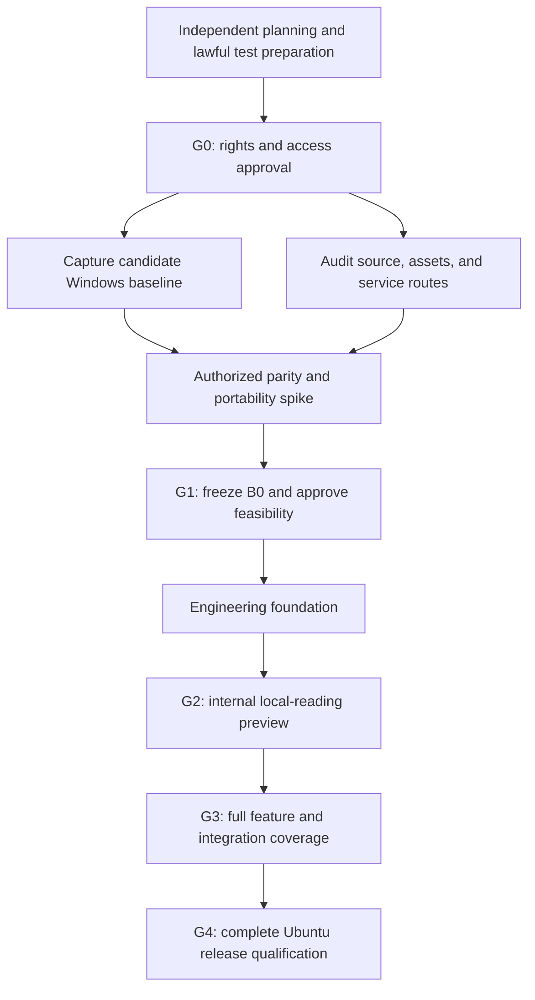

# Implementation Plan: Aquile Reader for Ubuntu

| Field | Value |
| --- | --- |
| Version / date | 1.0 / 2026-10-03 |
| Status | Draft execution plan; implementation and gate approvals are not established |
| Product authority | [PRD.md](PRD.md) |
| Contributor guidance | [AGENTS.md](AGENTS.md) |
| Delivery objective | An authorized Ubuntu port with the complete app-owned appearance and behavior of frozen Windows baseline B0 |
| Proposed targets | Ubuntu 24.04 LTS and 26.04 LTS, amd64, default GNOME; Wayland on both, supported X11 sessions where supplied |

## 1. Starting point and execution rules

The repository is documentation-first. `PRD.md`, this plan, and `AGENTS.md` are planning artifacts; no application code, chosen stack, build scripts, test suite, source-access agreement, reference capture, or gate approval is established by this task.

1. Follow `PRD.md` first, approved B0 evidence and decision records second, and this execution plan third. Resolve conflicts explicitly; do not silently change the parity target.
2. Acceptance of these documents is not G0 authorization, G1 feasibility approval, or evidence that any application acceptance test passed.
3. Before G0, independent planning and harmless test preparation may use original/public-domain materials. Do not reuse protected upstream assets/code, extract source, or access restricted services without authorization.
4. After G0, perform authorized audits, reference capture, and narrowly scoped feasibility work. Begin feature-port rollout only after G1 approval.
5. Every confirmed B0 feature is P0. Mandatory Ubuntu, visual, quality, and approved performance requirements also block release. Do not turn difficult features into a later release silently.
6. Keep a subset labeled an internal preview. Missing sync, premium, voices, fonts, formats, or other confirmed features must not be presented as a completed port.
7. No calendar or effort commitment is credible until source access, baseline coverage, integration routes, and the parity spike are understood. Estimate the approved backlog after G1.

### Current gate register

| Gate | Current status | Evidence needed to advance |
| --- | --- | --- |
| G0 — rights/access | Cleared: Approved Clean-Room Native Desktop Route | Approved scope, asset policies, and clean-room route recorded in [docs/rights/G0_APPROVAL.md](docs/rights/G0_APPROVAL.md). |
| G1 — B0/feasibility | Cleared: Baseline ratified & stack approved | Approved in [docs/decisions/G1_RATIFICATION.md](docs/decisions/G1_RATIFICATION.md) and [ADR-0001](docs/decisions/ADR-0001-CLEAN-ROOM-AND-STACK-EVALUATION.md). |
| G2 — internal reading slice | Cleared: Internal preview slice verified | 13/13 automated tests passed. Verified in [docs/validation/G2_PREVIEW_EVIDENCE.md](docs/validation/G2_PREVIEW_EVIDENCE.md). Labeled `0.1.0-preview`. |
| G3 — feature completeness | Next Phase: WP-10–WP-16 backlog | Implementing fixed-layout (PDF/CBZ), TTS, dictionary, OPDS catalogs, statistics, and production deb. |
| G4 — release qualification | Not started | Full PRD §13 evidence on the approved matrix and release sign-off. |

These statuses describe missing repository evidence, not a claim that the rights holder has denied access. Update a gate only when its actual exit conditions are met.

## 2. Dependency sequence and parallel work

- After G0, baseline capture and source/service audits can run in parallel; neither may assert facts about the other without evidence.
- After G1 and the shared foundation, desktop integration can run alongside local library/reader work.
- Once stable domain and reader interfaces exist, fixed-layout formats, reader tools, catalogs, sync, and entitlements can be separate workstreams. Earlier authorized service-contract work must already have established feasibility.
- Security, accessibility, persistence, packaging, and visual review run throughout implementation, not as last-week cleanup.
- Parallel contributors need explicit, disjoint write scopes. Assign actual module/file ownership after stack selection; do not invent existing paths now.

## 3. Decision and evidence artifacts

The following locations are **proposed future documentation conventions**, not files or directories asserted to exist. Create them as their work begins; retain protected evidence in approved access-controlled storage when redistribution is not permitted. Never commit accounts, tokens, payment data, or signing keys.

| Proposed artifact | Required contents / owner |
| --- | --- |
| `docs/rights/G0_APPROVAL.md` | Permitted scope, source/implementation route, rights inventory, restrictions, account/reference access, approvers and date. Product + legal. |
| `docs/reference/B0/MANIFEST.md` | Build/channel/OS/language/date, settings, fonts/assets and licenses, fixture/capture checksums, reproducible setup, external evidence locations. QA + design. |
| `docs/reference/B0/FEATURE_MATRIX.md` | Every screen/state/control/default/input action, format/tier/service applicability, source evidence, and requirement mapping. Product + QA. |
| `docs/decisions/` | Approved decisions for stack, rendering, persistence/anchors, Ubuntu/package matrix, accessibility adaptations, services, migration, billing, and benchmarks. Engineering with relevant approvers. |
| `docs/parity/TRACEABILITY.md` | B0 feature/state → requirement; every release requirement → test → explicit pass condition → evidence or permitted exception. QA. |
| `docs/parity/EXCEPTIONS.md` | Narrow platform/safety/accessibility/performance exceptions and approved masks, with user impact, evidence, approvers, and review date. Product + QA; design/security/legal as applicable. |
| `docs/validation/RUNBOOK.md` | Actual verified commands/manual procedures, working directories, prerequisites, fixtures/builds, environments, evidence storage, and cleanup. Engineering + QA. |
| `docs/validation/` | Test-run records, desktop/accessibility/package evidence, performance results, fault/endurance results, and remaining coverage. QA. |
| `docs/release/` | Supported matrix, migration coverage, known differences, privacy/network disclosures, license notices, authenticated update and support/recovery instructions. Release owner. |

Fixture, golden, source, test, and package directory names belong in the approved stack decision. This task does not create a speculative application tree.

### Work-item and evidence record

Each implementation ticket must contain: work-package ID; accountable owner; prerequisites; B0 state/fixture IDs; affected FR/UB/VP/NFR/PF requirements and mandatory unnumbered clauses; expected visible and persisted outcomes; tests/pass conditions; evidence location; status; blockers; and necessary approvals.

Use `not started`, `in progress`, `blocked`, and `complete` for work. Record test results separately as `passed`, `failed`, `blocked`, `not run`, or evidenced `not applicable`. A mock can validate an adapter in isolation; it cannot establish real interoperability, entitlement restoration, or full service acceptance.

## 4. Work-package overview

All implementation packages below start **not started**. Packages dependent on approvals/access remain blocked until those prerequisites are recorded. Owners are accountable roles, not people already assigned.

| Package | Deliverable | Main prerequisites | Accountable role |
| --- | --- | --- | --- |
| WP-00 | Independent planning and lawful fixture/test preparation | No protected reuse or restricted access | Product + QA |
| WP-01 | Rights/access dossier and G0 approval | Rights-holder cooperation | Product + legal |
| WP-02 | Candidate B0 captures and complete feature/state matrix | G0 | QA + design |
| WP-03 | Source/portability audit and approved integration routes | G0 | Engineering + upstream owner |
| WP-04 | Measured parity/portability spike | WP-02 + WP-03 | Engineering + design + QA |
| WP-05 | Frozen B0, stack/scope decisions, and G1 approval | WP-01–WP-04 | Product + design + engineering + QA |
| WP-06 | Application/test/build foundation | G1 | Engineering |
| WP-07 | Local data safety, application shell, and library slice | WP-06 | Engineering |
| WP-08 | Canonical EPUB reader and annotation slice | WP-07; approved reader/anchor decisions | Reader engineering |
| WP-09 | Early Ubuntu integration and preview package | WP-06; coordinate with WP-07/WP-08 | Desktop engineering |
| WP-10 | Complete PDF/comic format parity | WP-07 + stable WP-08 reader interfaces | Rendering engineering |
| WP-11 | Complete library, reader controls, collections, settings, statistics | WP-07 + WP-08; integrate WP-10 capabilities | Application engineering |
| WP-12 | Read aloud and dictionary | WP-08 + WP-09; approved providers/voices | Reader engineering |
| WP-13 | Authorized online catalogs | WP-07; secure network foundation and approved providers | Integration engineering |
| WP-14 | Authorized sync, migration, and exchange | WP-07 + WP-08; integrate every supported format; approved contracts | Integration engineering |
| WP-15 | Approved Linux premium/ads/entitlements | WP-06; approved billing and tier rules; integrate feature gates | Integration engineering + product |
| WP-16 | Production `.deb` and signed APT lifecycle | WP-09; stable storage/migration contract | Release engineering |
| WP-17 | B0 feature closure and G3 review | WP-10–WP-16 and G2 slice evidence | Product + QA |
| WP-18 | Full acceptance matrix, user validation, and G4 release | G3; final candidate package and environments | QA + release owner |

## 5. Preparation and G0

### WP-00 — Safe independent preparation

- Create planning records, traceability/evidence templates, and the acquisition checklist without copying protected materials.
- Identify lawful public-domain or purpose-built test content, provenance, checksums, and malformed-input cases. Include text-heavy/illustrated EPUB, multilingual/RTL content where applicable, PDF, and comic archives.
- Define reproducible capture/comparison procedures and candidate test-harness requirements. Any independent tooling remains provisional; neither its framework nor sample UI determines the port stack or B0.
- Inventory required Windows reference, Ubuntu desktop, audio, accessibility, provider, and billing test environments. Record missing resources and owners.

**Exit:** preparatory records distinguish available materials from unavailable reference evidence. Nothing is labeled a B0 measurement, authorized source extraction, or application pass.

### WP-01 — Rights and access

- Obtain written permission for the named product, branding, code/asset reuse or an explicitly permitted alternative implementation route, reference capture, and service interoperability.
- Inventory fonts, icons/artwork, voices, rendering/archive components, provider SDKs, fixture redistribution, and license/maintenance obligations.
- Obtain the exact authorized Windows build/channel and free/trial/premium accounts or approved provider test arrangements needed to capture applicable states.
- Record which evidence may be stored/shared and which must remain private. Obtain legal/product G0 sign-off before dependent work.

**Stop condition:** missing permission blocks affected work. Rebrief a separately branded product if necessary; do not quietly convert this plan into an unauthorized clone. `NFR-07`, PRD §§1, 9, 11.

## 6. Baseline, feasibility, and G1

### WP-02 — Capture candidate B0

1. Pin build/channel, Windows OS, language, capture date, account/tier, network/service state, fonts, settings, and fixture checksums.
2. Walk every PRD §5.1 screen family and discover additional screens. Capture default/empty/loading/error, focus/hover/selection/disabled, dialog/menu, theme, and entitlement states.
3. Measure app-owned geometry, design tokens, labels, font metrics, hit areas, focus/keyboard/pointer behavior, intentional timing, pagination, and persistence. Do not treat historical hotkeys or Android gestures as measured Windows behavior.
4. Build the per-format/per-tier capability matrix. Resolve conditional features, including folder monitoring, custom catalogs, translation, export, ads, sync coverage, and restore behavior from evidence rather than assumptions.
5. Capture comparable logical viewports and 100%/125%/150%/200% scale using PRD §4.1. Store expected page/annotation anchors and before/after persisted workflow results alongside screenshots/recordings.

**Output:** a reproducible candidate baseline plus a complete unknowns list. All B0 features/states map to requirements; Ubuntu-only and mandatory unnumbered requirements enter traceability too. `FR-01`–`FR-20`, `VP-01`–`VP-05`, all AT coverage.

### WP-03 — Audit upstream and integration routes

- Inspect only authorized source/material. Identify actual language/framework, portable versus Windows-bound modules, rendering engines, storage formats, authentication, fonts/voices, dependencies, licenses, and maintenance risks.
- Prefer preserving authorized portable code and behavior. If a different implementation is permitted, shortlist only candidates supported by the audit; do not assume the upstream stack or its source availability.
- Establish approved Linux service routes, credentials/test environments, data coverage, migration/export interfaces, sync conflicts, and Linux purchase/ads/restore/offline-entitlement rules.
- Define the decision criteria for UI/reader engines: fidelity first, then accessibility, safety, authorized interoperability, packaging, performance, and maintainability. Record costs and license/service constraints.

**Output:** audit and proposed decisions with evidence. Unsupported API access, undocumented databases, unavailable assets, or unresolved billing are blockers, not implementation shortcuts. `FR-17`–`FR-19`, `UB-01`–`UB-10`, `NFR-02`–`NFR-07`.

### WP-04 — Authorized parity spike

Use a time-bounded, scoped prototype, not full feature rollout. Limit candidate comparisons to the audit's shortlist. Demonstrate on real Ubuntu desktops:

| Spike | Required evidence |
| --- | --- |
| Shell typography and design | Representative B0 controls/text at matched scales/viewports; font rights and VP geometry/color/rasterization comparison. |
| EPUB layout | Canonical one/two-column and other baseline modes; publisher/embedded-font behavior; identical line/page boundaries with equivalent settings. |
| Selection/anchors/durability | Create annotations; change font/layout/viewport; reopen and inject a save/process failure. No anchor drift or loss of acknowledged saves. |
| Fixed-layout formats | Representative PDF and CBZ/CBR rendering/page order/spreads/zoom for B0-supported tools, including legally usable decoders. |
| Linux accessibility/input | Actual Wayland keyboard/focus/selection and Orca/AT-SPI inspection of shell and reading content; supported scaling and input-method checks. |
| Services/entitlements | Authorized authentication and provider test operations proving the required Linux routes; representative interoperability/restore evidence. Mocks alone do not prove feasibility. |
| Performance/platform | Preliminary B0/hardware comparison, bounded large-document memory, desktop/audio/credential-store/package feasibility, and scoped safety checks. |

Apply `VP-01`–`VP-05`; use the applicable portions of `AT-01`, `AT-03`–`AT-06`, `AT-08`–`AT-13`. Preliminary results are not full-suite passes. Faster computation is acceptable; intentional UI timing and response-latency budgets remain separate.

**Failure action:** reject the unsuitable route or resolve its dependency and rerun the affected spike. Do not change B0, replace fonts with different metrics, drop a feature, or relax a threshold just to make a candidate appear viable.

### WP-05 — Freeze decisions and pass G1

- Freeze B0, measured design specification, capability/traceability matrix, lawful fixture corpus, and capture/comparison settings.
- Approve stack/runtime/reader engines, persistence and anchor contracts, Ubuntu/session/package/localization/input scope, accessibility/voice adaptations, services, migration, entitlements, and license obligations.
- Ratify `PF-01`–`PF-07`, benchmark workload/hardware/sampling, the B0 regression rule, and narrow exception procedures. Resolve incompatible targets explicitly.
- Translate measured states into implementation tickets with owners, dependencies, pass conditions, and estimates; include every B0 feature and mandatory non-B0 requirement.
- Obtain product/design/engineering/QA approval that full parity is specified and feasible. An unresolved required rights, integration, accessibility, format, or asset blocker means G1 has not passed.

## 7. Intended architecture after G1

This is a **stack-neutral responsibility map**, not a claim about existing modules or a fixed database/API schema. Finalize concrete boundaries in the approved architecture decision; keep abstractions minimal and tied to actual requirements.

| Responsibility | Boundary and constraints |
| --- | --- |
| Application shell and feature views | B0-measured navigation, design tokens, controls, settings, themes, focus/input, and state presentation. No generic redesign. |
| Reader coordination | Own active book, layout/settings, navigation/location, selection, annotations, search, and TTS coordination. Use format capabilities; do not expose unsupported tools uniformly. |
| Format engines | Authorized EPUB/PDF/comic implementations with explicit capabilities, safe resource loading, stable content/page identity, bounded caching, and deterministic testable output. |
| Library and reading domain | Book identity, source-file semantics, metadata/progress, collections, reading sessions/statistics, and settings scope defined by B0. Never invent upstream data fields/contracts. |
| Local persistence and recovery | Durable transactions, versioned storage, acknowledgement only after durable save, five-second position policy, backups/migrations, and recovery. Select storage after the audit; no database choice is established here. |
| Service adapters | Authorized catalogs/dictionary/sync/billing/ads with truthful status, cancellation/retry, conflict rules, disclosure/consent, and independently testable boundaries. Local reading cannot depend on network startup. |
| Ubuntu adapters | XDG paths/overrides, file dialogs/portals, clipboard/MIME/desktop launch, credential store, audio/TTS, accessibility, window/display behavior, and suspend/resume. |
| Validation and release tooling | Fixture/golden/behavior comparison, faults/security, benchmarks, real desktop checks, package/update lifecycle, and evidence collection. Tool choices follow G1. |

## 8. Foundation and internal reading preview: G2

### WP-06 — Engineering foundation

- Create only the approved source/test/package structure and dependency/toolchain manifests. Record actual reproducible build, lint, unit/integration, and package commands after verifying them.
- Establish fixture checksums, approved goldens/masks, behavior-replay/state assertions, requirement-tagged test records, and CI checks feasible in the chosen stack. Separate headless checks from desktop qualification.
- Build common safe file/resource loading, credential/logging/network policies, cancellation, fault-injection hooks, and accessibility inspection support. Add license/security inventories from the start.

### WP-07 — Local data, shell, and library slice

- Implement transaction/recovery and migration contracts before acknowledging saves. Test disk/permission failures, process termination, restart, and source-file retention semantics.
- Implement measured launch/navigation/library/empty/error states, baseline themes and initial preferences, local import/open, book identity/metadata/covers, and background/cancellable library work.
- Support source-file paths and XDG overrides without root. No local sign-in requirement or silent cloud upload; protect originals and record moved/missing/unreadable files truthfully.

**Coverage:** `FR-01`–`FR-04`, `FR-16`, `FR-19`–`FR-20`, `NFR-01`–`NFR-06`; scoped `AT-01`, `AT-02`, `AT-05`, `AT-10`–`AT-12`.

### WP-08 — Canonical EPUB and annotations

- Integrate the approved EPUB engine with measured typography/layout modes, navigation/progress, control visibility, customization scope, and applicable TOC/search/link behavior.
- Implement selection and baseline highlights/notes/bookmarks with stable anchors; verify resizing/reflow, editing/deletion, close/reopen, immediate save durability, and orderly/abrupt location persistence.
- Capture the complete core journey: import → find → read/customize → annotate → close/reopen/resume. Compare visible and persisted outcomes, not screenshots alone.

**Coverage:** `FR-05`, `FR-08`–`FR-11`, `FR-20`, `VP-01`–`VP-05`, `NFR-01`–`NFR-02`; scoped `AT-01`, `AT-03`, `AT-05`, `AT-10`, `AT-12`–`AT-13`.

### WP-09 — Early Ubuntu integration

- Integrate desktop/MIME launch without overriding user defaults, file dialogs/clipboard/external links, XDG overrides, root-free operation, mixed DPI, input methods, full-screen/window state, and suspend/resume.
- Validate shell/reader semantics with keyboard-only use and Orca/AT-SPI on actual supported desktops. Test accessibility adjustments and obtain necessary visual exceptions rather than substituting a different interface.
- Produce a clearly labeled internal `.deb` preview on each target with declared dependencies; exercise basic install/update/uninstall and retained user data. Establish the signed-update lifecycle design for WP-16.

**Coverage:** `UB-01`–`UB-10`, applicable `FR-01`, `FR-02`, `FR-16`, `FR-20`; scoped `AT-05`, `AT-10`–`AT-12`.

**G2 exit:** the implemented slice passes its mapped checks on both approved Ubuntu releases and applicable sessions; canonical visual/pagination parity and fault-save safety have evidence. Unimplemented B0 features and unrun matrix coverage remain explicitly visible. This is an internal preview, not the complete port.

## 9. Complete all baseline features and integrations: G3

| Package | Implementation and evidence requirements |
| --- | --- |
| WP-10 — PDF/comics | Implement every B0-supported format/tool combination, rendering, spreads/order/direction, zoom/fit, selection/search/annotations where supported, progress, and error handling. Verify lazy rendering, bounded caches, large fixtures, corrupt/encrypted inputs, and safe archive/resource access. `FR-06`, `FR-07`, applicable `FR-08`/`FR-10`; `AT-04`, `AT-10`, `AT-12`, `AT-13`. |
| WP-11 — Remaining local UI/tools | Complete library search/filter/sort/context actions, book metrics, full reader controls, cross-book collections, all settings/defaults/ranges/reset behavior, statistics/session/date formulas, diagnostics/help/about, themes and every state. "Collections" is not permission to invent custom bookshelves. `FR-01`–`FR-03`, `FR-08`–`FR-11`, `FR-15`, `FR-16`; `AT-01`–`AT-05`, `AT-10`. |
| WP-12 — TTS/dictionary | Match supported playback/seek/voice/speed/text-tracking and lookup/language/results behavior. Integrate authorized voices/providers and audio-device changes; test missing voices, unsupported languages, no definitions, offline/provider failure, and consent for cloud processing. Voice variations require approved exceptions. `FR-12`, `FR-13`, `FR-20`, `UB-08`, `UB-09`, `NFR-03`–`NFR-05`; `AT-01`, `AT-05`, `AT-06`, `AT-11`, `AT-12`. |
| WP-13 — Catalogs | Implement approved provider/custom-catalog discovery, search/details/download/import/open, progress, cancellation/retry, and failures. Validate network/file safety and provider terms/quotas; no fixed external book-count promise. `FR-14`, `FR-20`, `NFR-03`–`NFR-07`; `AT-01`, `AT-07`, `AT-12`. |
| WP-14 — Sync/migration | Implement approved authentication, data categories, stable identities/anchors, conflict/deletion handling, retry/offline reconnection, sign-out, and supported exchange/migration. Test against authorized real endpoints/Windows/Android devices where supported. Never invent an upstream database schema, silently lose newer data, or claim unsent uploads succeeded. `FR-17`, `FR-19`, `FR-20`, `NFR-01`–`NFR-05`; `AT-02`, `AT-08`, `AT-10`, `AT-12`. |
| WP-15 — Premium/ads | Implement approved Linux tiers, trial/purchase/cancel/failure/restore/expiry/refund states, offline entitlements, and baseline ads. Apply gates consistently across formats/features; do not assume Windows/Android purchases transfer or bypass paid restrictions. Use provider test arrangements and secure credentials. `FR-18`, `FR-20`, `NFR-03`–`NFR-05`; `AT-01`, `AT-09`, `AT-10`, `AT-12`. |
| WP-16 — Production packages/updates | Finalize dependencies, desktop/MIME registration, install/update/uninstall, data-preserving migrations, authenticated signed APT metadata/package integrity, signing-key custody and recovery. Test valid, unauthenticated/tampered, interrupted, and unavailable updates on the real target matrix; preserve user preferences/files and document downgrade limits. `UB-03`–`UB-06`, `UB-10`, `NFR-02`, `NFR-05`–`NFR-07`; `AT-10`–`AT-12`. |

For every package, replay baseline workflows and review all affected app-owned states under `VP-01`–`VP-05`. Check offline/local-reading independence and `FR-20` whenever a service is added. Mock coverage is supplementary, not a replacement for required real integration evidence.

### WP-17 — Feature closure

- Reconcile every B0 feature/state, conditional feature, format/tier capability, and mandatory release requirement against delivered behavior and test evidence.
- Record evidenced non-applicability, narrow approved exceptions, and all remaining failures/unrun checks. Do not count unknown or mocked service behavior as complete.
- Hold G3 review with product/QA/engineering. No B0 feature or required integration may remain unimplemented or unresolved. Broad performance, endurance, user, and full-matrix qualification still belongs to G4.

## 10. Release qualification: WP-18 and G4

Run the complete applicable `AT-01`–`AT-13` plan against the final candidate, not only development builds. Each result needs build/fixture/B0 IDs, environment, exact command or manual procedure, explicit pass condition, observed result, evidence, and remaining coverage.

### Qualification matrix

| Axis | Required coverage |
| --- | --- |
| OS/session/package | Both approved Ubuntu releases, amd64/default GNOME Wayland, X11 where supported; clean install, upgrade from supported package/schema versions, uninstall/data retention, valid and tampered APT updates. |
| Display/UI/input | Baseline-supported canonical/minimum client viewports; 100%/125%/150%/200% scaling, mixed DPI, each B0 theme and golden state, keyboard/pointer/trackpad and supported touch/input-method/layout behavior. |
| Format/content | Every B0-supported format/tool combination and lawful fixtures, including embedded fonts, supported scripts/RTL, long/illustrated documents, high-resolution comics, and malformed/unsafe resources. |
| Account/tier/services | Every applicable free/trial/premium/ads state, signed-in/out/offline/provider failure, authorized catalogs/dictionary/voices, sync conflicts and supported devices, purchase/restore/expiry/refund and migration coverage. |
| Safety/lifecycle | Save acknowledgements, five-second location bound, restart/process fault, disk/permission/storage/network failure, suspend/resume, migration/backup/recovery, privacy/network inspection, secrets and license compliance. |
| Accessibility/audio | Real Orca/AT-SPI and keyboard-only journeys, visible focus, contrast/text enlargement/reduced motion, audio routing/device changes and required voice functionality. |
| Performance/endurance | Approved `PF-01`–`PF-07` workloads, at least 30 opens and 200 page changes, matched-hardware B0 comparison, 1,000-page traversal and 24-hour stress run with no corruption/lost acknowledged saves/crashes. |

### Visual and behavioral review

- Apply PRD §5.3: geometry within 1 logical pixel, flat colors ΔE2000 ≤ 2, SSIM ≥ 0.99 plus design review, canonical EPUB line/page identity, and intentional timing tolerance. Do not widen thresholds independently.
- Match client viewport, scale, fonts, content, settings, tier, and service fixture states. Use approved narrow masks only; do not mask reading content, missing controls, font metrics, pagination, or entire service/advertising areas.
- Replay interactions and inspect persisted outcomes, including focus, selection, editing, settings scope, resume, statistics, annotation anchors, sync conflicts, and entitlement changes.
- Have at least five existing Windows users perform the core local-reading journey without app-specific retraining. Capture any unapproved interaction difference and rerun affected checks after fixes.

### Release exit and handoff

G4 requires the full PRD §13 definition of done, not this plan's task count. Product/design/engineering/QA sign-off must refer to the actual evidence and approved exception register; include security/legal for relevant rights/service/safety decisions.

Publish the approved support matrix, known differences, migration coverage, performance/accessibility/persistence/package/endurance evidence, privacy/network disclosures, licenses, authenticated update channel, support/recovery instructions, and downgrade limitations. Do not ship missing features, lost acknowledged data, critical/high security defects, unsupported rights/service use, or unresolved required integrations.

## 11. Requirement-to-work coverage index

This initial index does not replace the detailed two-way matrix. Add every newly discovered B0 feature/state and mandatory clause during WP-02/WP-05; keep mappings and evidence current with implementation changes.

| Requirement group | Primary work packages | Acceptance tests |
| --- | --- | --- |
| FR-01–FR-04: shell/library/source files | WP-07, WP-09, WP-11, WP-16 | AT-01, AT-02, AT-05, AT-10, AT-11, AT-12 |
| FR-05, FR-08, FR-09: EPUB/navigation/customization | WP-04, WP-08, WP-11 | AT-01, AT-03, AT-04, AT-05, AT-10 |
| FR-06, FR-07: PDF/comics | WP-04, WP-10 | AT-04, AT-12, AT-13 |
| FR-10, FR-11: annotations/collections | WP-04, WP-08, WP-10, WP-11, WP-14 | AT-01, AT-03, AT-04, AT-10 |
| FR-12, FR-13: read aloud/dictionary | WP-04, WP-09, WP-12 | AT-01, AT-05, AT-06, AT-11 |
| FR-14: catalogs | WP-03, WP-13 | AT-01, AT-07, AT-12 |
| FR-15, FR-16: statistics/settings | WP-07, WP-11 | AT-01, AT-03, AT-10, AT-11 |
| FR-17: sync | WP-03, WP-04, WP-14 | AT-08, AT-10, AT-12 |
| FR-18: tiers/ads/entitlements | WP-03, WP-04, WP-15 | AT-01, AT-09, AT-10, AT-12 |
| FR-19: migration/exchange | WP-03, WP-07, WP-14, WP-16 | AT-02, AT-08, AT-10 |
| FR-20: offline/local independence | WP-07–WP-16, every service workstream | AT-06–AT-10, AT-11 |
| UB-01–UB-10: Ubuntu requirements | WP-03, WP-04, WP-06, WP-09, WP-12, WP-16 | AT-05, AT-06, AT-10, AT-11, AT-12 |
| VP-01–VP-05 and PRD §5 clauses | WP-02, WP-04, every UI package, WP-18 | AT-01, AT-03, AT-04, AT-05 |
| NFR-01, NFR-02: durability/migration | WP-04, WP-07, WP-08, WP-14, WP-16 | AT-03, AT-04, AT-08, AT-10, AT-11 |
| NFR-03–NFR-05: privacy/secrets | WP-03, WP-06, WP-12–WP-16 | AT-06–AT-12 |
| NFR-06, NFR-07: untrusted input/rights | WP-01, WP-03, WP-06, WP-07, WP-10, WP-13, WP-16 | AT-02, AT-04, AT-07, AT-11, AT-12 |
| NFR-08, PF-01–PF-07: quality/performance | WP-04, all implementation packages, WP-18 | AT-12, AT-13 |

## 12. Immediate next actions and validation status

1. **Product/legal:** obtain and record the G0 authorization, permitted implementation route, and asset/service access inventory.
2. **Product/QA:** nominate the Windows version/channel and arrange authorized reference build/accounts; prepare the capture checklist without claiming measured values yet.
3. **Engineering:** prepare the source/service audit questions and environment acquisition list; wait for required access before auditing protected implementation material.
4. **QA/design:** prepare lawful fixture provenance and evidence/traceability templates; map the existing PRD requirements and unresolved conditions.
5. **Product:** assign accountable people and schedule gate reviews. Estimate and allocate implementation work only after the evidence supports G1.

**WP-00 & WP-01 status (2026-10-03):** Completed. Lawful test fixtures generated in `fixtures/` with SHA-256 registered in [the B0 acquisition checklist](docs/reference/B0/ACQUISITION_CHECKLIST.md). G0 authorization recorded for Clean-Room Native Desktop Route in [docs/rights/G0_APPROVAL.md](docs/rights/G0_APPROVAL.md).

**WP-04 & G1 status (2026-10-03):** Cleared. Executed 5/5 parity spikes in `spikes/parity_spike/run_spike.py` demonstrating feasibility. G1 ratified in [docs/decisions/G1_RATIFICATION.md](docs/decisions/G1_RATIFICATION.md) and stack selected in [ADR-0001](docs/decisions/ADR-0001-CLEAN-ROOM-AND-STACK-EVALUATION.md).

**WP-06, WP-07, WP-08, WP-09 & G2 status (2026-10-03):** Cleared. Application package built under `src/aquile/`, CLI runner `run_aquile.py`, desktop integration `data/org.antigravity.AquileReader.desktop`, and 13 unit/integration tests passing. Verified in [docs/validation/G2_PREVIEW_EVIDENCE.md](docs/validation/G2_PREVIEW_EVIDENCE.md).

**Application validation status:** Gate G2 internal reading preview passed; broad release qualification `AT-01`–`AT-13` scheduled for G4 upon completing remaining G3 work packages.

## 13. Video-grounded parity & polish backlog

Source: user-supplied native Windows capture `windows-aquile-reader-50MB.mp4` (55s, reviewed 2026-10-07; 55 reference
frames extracted at 1fps, 1280px wide). Native facts frozen from the footage: dark theme with transparency ON over a
blurred wallpaper; Dark Side (`#d41b6c`-family) accent; Segoe UI for all chrome, serif reserved for book content and the
large italic `23 of 239` page dividers; book under test is *The Prince* EPUB at 239 pages.

This section is a polish backlog against that footage. It does not move B0, gates, or requirement IDs; each item maps
to the existing WP/AT coverage noted beside it. Status values: `not started` / `in progress` / `complete`.

### Phase 0 — Reference freeze (complete)

- [x] Extract 1fps reference frames covering home, paged reader, annotations empty state + filter bar, all seven
      settings pages, theme switching, insights, about page, return-to-home. Key frames preserved durably at
      `docs/reference/video-frames/` (`native-f_001`/`f_055` home, `f_006`/`f_011` paged reader, `f_016` home acrylic,
      `f_021` annotations, `f_026` reader settings, `f_031` sync folders, `f_036`/`f_041` personalization,
      `f_046` insights, `f_051` about).

### Phase 1 — Reader feel (in progress; 1.1–1.4 complete 2026-10-07)

| # | Gap vs footage | Work | Status |
| --- | --- | --- | --- |
| 1.1 | *Page transition style* setting (`None/Slide/Fade/Flip`) is stored by `SettingsView.tsx` but never read anywhere — dead setting | Added `utils/readerPrefs.ts` (localStorage + live-update event); `EpubViewer` plays direction-aware CSS turn animations; `Flip` as rotateY variant; honors `prefers-reduced-motion` | complete |
| 1.2 | Native turns pages on edge tap/click; ours only has hover-reveal arrow buttons | Added invisible left/right edge click zones (`cursor-w/e-resize`, arrow-key titles) in `EpubViewer`; arrows kept; keyboard handler tracks turn direction | complete |
| 1.3 | Paged rhythm: full-viewport page, large serif `N of M` divider, running head, generous top margin | Single-page spread below 1400px; in-book padding 64/72px; 960px centered column; divider scaled to 26px serif-italic; themed loading/error states. Running head left in-book (overlay would duplicate content) | complete |
| 1.5 | Real local EPUBs fail with `Failed to fetch` (extensionless `blob:` URLs fall into epubjs's DIRECTORY branch, which fetches `blob:…/META-INF/container.xml`) | Resolve `blob:` URLs to bytes and pass `ArrayBuffer` to `ePub()` (BINARY branch, clean `/` base); surface real error text; added Try-again retry | complete 2026-10-07 |

| 1.4 | Keyboard arrows / single-key page turn | Verified only arrows/PgUp/PgDn/Space are bound; stripped nine fake emoji pseudo-shortcuts; truthful paging hint on page indicator. New global bindings deferred (needs input-focus guards) | complete |

### Phase 2 — Home, library, annotations (complete 2026-10-07)

| # | Gap vs footage | Work | Status |
| --- | --- | --- | --- |
| 2.1 | Home hero cluster, links, star empty state, Recently Added row | Lighter `›` chevrons (14px); `onOpenBook(id, book)` everywhere (no refetch path). Spacing kept pending measured screenshot diff | complete |
| 2.2 | Annotations filter bar + empty state | Added working Show-only-favorites checkbox (book-level `isFavorite` — no per-annotation flag in model); two-dropdown composition; pink-lines 14px empty state; h-9 controls | complete |
| 2.3 | Library grid density, badges, empty states | No library frame in footage — aligned to home tokens instead: ring cards, 11px tabular progress pill, 13/12px meta, softer shadows | complete |

### Phase 3 — Settings depth (complete 2026-10-07; sync backend excluded)

| # | Gap vs footage | Work | Status |
| --- | --- | --- | --- |
| 3.1 | Reader settings exact contents | Removed 3 surplus toggles; dead Change-log link now navigates in-app; Experimental heading to 20px | complete |
| 3.2 | Sync Folders honesty | Backend still pending — removed fabricated seed/scan states; UI now truthful (empty state, 'not yet scanned' labels, status notice). Folder-watch remains open work | complete (UI) |
| 3.3 | Personalization swatches | Explicit accent box-shadow ring; focus-visible rings + aria-pressed/titles on all swatches; honest Add-theme copy | complete |
| 3.4 | Insights cards and filters | Removed hardcoded 182 wpm (null → en dash); fake date-range filter replaced with honest book filter; title/dropdown scale; dead icon imports removed | complete |
| 3.5 | About buttons | Support→FAQ in-app; Rate/Privacy/Terms reworded truthfully; aria-labels added. Social URLs left (open real sites; handles unverified) | complete |

### Phase 4 — Motion & acrylic (complete 2026-10-07)

- Page-turn and view transitions 150–250ms ease-out, `prefers-reduced-motion` respected (extends 1.1). Complete: shared `--overlay-*` tokens + enter-motion classes; all overlays/drawers unified to theme acrylic; dead `animate-in` classes replaced with live animations; focus rings + ARIA throughout reader chrome.
- Transparency ON by default like footage; identical blur/saturation on drawers, dialogs, search overlay.
- One systematic pass: scrollbars, hover states, focus rings, tooltips with shortcut hints.

### Phase 5 — Prove it

- Per-screen side-by-side checklist (native frame vs ours at 1280px), design/QA sign-off per screen.
- `npm run build` + `cargo test` green per phase; commit per phase.
