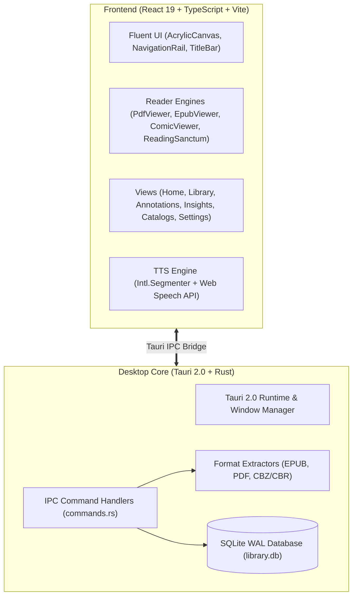

# Aquile Reader

<div align="center">


### Modern, Versatile eBook & Comic Reader with Native Fluent Design

[](https://github.com/ParasRana1729/Aquile-Reader/releases)
[](LICENSE)
[](https://tauri.app/)
[](https://www.rust-lang.org/)
[](https://react.dev/)
[](https://www.typescriptlang.org/)
[]()

</div>

---

## Overview

**Aquile Reader** is a high-performance desktop reading application built from the ground up in **Rust** and **Tauri 2.0** with **React 19**, **TypeScript**, and **Tailwind CSS**. Designed to faithfully replicate the fluid aesthetics of modern Windows Fluent Design, it brings native Acrylic materials, dynamic theme-accent titlebars, continuous reading engines, voice narration, and reading analytics to the modern desktop.

---

## Key Features

### 📖 Multi-Format Reader Engines
- **EPUB**: Paginated and spread layouts powered by Epub.js with custom spine traversal, chapter index, and typography engine.
- **PDF**: Continuous vertical scroll and dual-page spread modes with high-DPI canvas rendering and viewport virtualization.
- **Comics & Manga**: Direct reading of `.cbz` and `.cbr` archives with zoom, stretch, and fit-width viewing.
- **Reading Sanctum**: Clean, distraction-free typography reader for focused reading.

### 🎨 Windows Fluent & Acrylic Material Design
- **Live Acrylic Frosted Glass**: Dynamic background blur (`backdrop-filter: blur(32px) saturate(180%)`) with customizable opacity slider and wallpaper simulation.
- **8 Windows Accent Themes**: *Clear Sky*, *Dark Side*, *Vine Yard*, *Fresh Berry*, *Pulpy Orange*, *Flash*, *Turquoise*, and *Green Apple*.
- **Integrated Client Titlebar**: Context-sensitive back navigation, reading title badges, and authentic Fluent caption buttons (Minimize, Maximize, Close).
- **Navigation Rail**: 52px slim navigation rail with glowing active accent indicators.

### 🔍 Full-Text In-Book Search
- Instant text querying across all PDF pages and EPUB spine documents.
- Real-time match counter (`1 of 14`), keyword context excerpts, and instant page/CFI jumping.

### 🎙️ Text-to-Speech (TTS) Narration
- Continuous voice narration with intelligent sentence boundary segmentation (`Intl.Segmenter`).
- **Synchronized Highlighting**: Real-time spoken word and sentence tracking.
- **Floating Acrylic Controller**: Play, pause, jump sentences, customize voice profiles, and fine-tune playback speed ($0.5\times$ to $2.5\times$).
- **Auto-Turn**: Automatically advances pages and chapters when current section narration completes.

### 📝 Annotations & Notes Hub
- Centralized hub to manage all bookmarks, highlights, and margin notes across your entire library.
- Color-coded highlight categorization, text search, and single-click jumping directly into the reader.
- Export annotations to structured **Markdown** (`.md`) files.

### 📊 Reading Insights & Analytics
- Track daily reading time, estimated words read, and reading speed (WPM).
- Consecutive reading streaks (*Days in row*, *Weekly streak records*).
- Interactive SVG monthly trend charts with toggles for Days Read, Reading Time, and Pages.
- Backed by an automated SQLite database in WAL mode.

### 🌐 OPDS Catalogs & Bulk Library Ingestion
- Pre-configured feeds for **Project Gutenberg** and **Standard Ebooks**, plus custom OPDS feed support.
- One-click book downloading with offline metadata generation.
- **Drag-and-Drop**: Drag multiple `.epub`, `.pdf`, `.cbz` files directly onto any window to import instantly.
- **Folder Scanner**: Recursively scan directories to discover and import your collection in bulk.

### ⚙️ Typography & Layout Suite
- **Two-Page Spread**: Dual-column reading layout for widescreen monitors.
- Fine-grained typography sliders for font size, page margins ($16\text{px}$–$120\text{px}$), line height ($1.2$–$2.4$), letter spacing, and paragraph spacing.
- Typeface selector with support for *Inter*, *Merriweather*, *Georgia*, *JetBrains Mono*, *Bookerly*, *Literata*, or custom font family names.

---

## Architecture



---

## Installation & Downloads

Pre-built Linux packages are available on the [**Releases**](https://github.com/ParasRana1729/Aquile-Reader/releases) page.

### Debian / Ubuntu (`.deb`)

```bash
# Download latest .deb from Releases
sudo dpkg -i aquile-reader_*.deb
# If there are missing dependencies:
sudo apt-get install -f
```

### Portable AppImage (`.AppImage`)

```bash
chmod +x aquile-reader_*.AppImage
./aquile-reader_*.AppImage
```

---

## Building from Source

### Prerequisites

- **Node.js** (v20 or higher) and `npm`
- **Rust** (stable toolchain, 1.80+)
- Linux system dependencies (Debian/Ubuntu):
  ```bash
  sudo apt-get update
  sudo apt-get install -y \
    libwebkit2gtk-4.1-dev \
    build-essential \
    curl \
    wget \
    file \
    libssl-dev \
    libayatana-appindicator3-dev \
    librsvg2-dev
  ```

### Development Setup

1. **Clone the repository**:
   ```bash
   git clone https://github.com/ParasRana1729/Aquile-Reader.git
   cd Aquile-Reader
   ```

2. **Install frontend dependencies**:
   ```bash
   npm install
   cd frontend && npm install && cd ..
   ```

3. **Run tests**:
   ```bash
   npm test
   ```

4. **Launch development environment**:
   ```bash
   npm run dev
   # Or run Tauri development shell:
   npx @tauri-apps/cli dev
   ```

5. **Build release package**:
   ```bash
   npm run build:desktop
   ```
   Built installers will be generated under `src-tauri/target/release/bundle/`.

---

## Roadmap

- [x] Tauri 2.0 + Rust native backend rewrite
- [x] Windows Fluent Acrylic theme engine & client titlebar
- [x] Multi-format reader engines (PDF, EPUB, Comic, Sanctum)
- [x] In-book text search with snippets and page navigation
- [x] Persistent annotations, bookmarks & Markdown export
- [x] SQLite reading insights, streak counters & SVG charts
- [x] Text-to-Speech narration with synchronized word highlighting
- [x] Multi-file drag-and-drop & recursive folder scanner
- [x] Two-page spread mode & custom typography suite
- [x] GitHub Actions CI & automated release packaging

---

## License

This project is licensed under the [MIT License](LICENSE).
